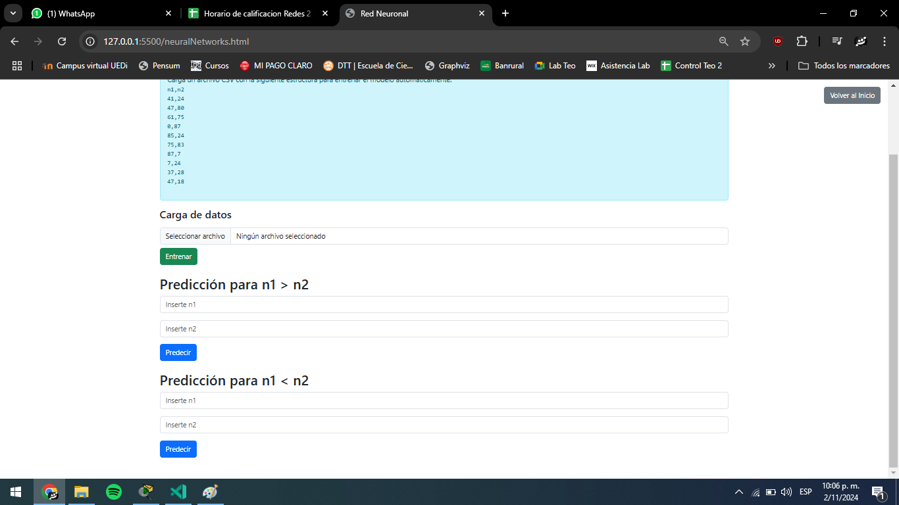
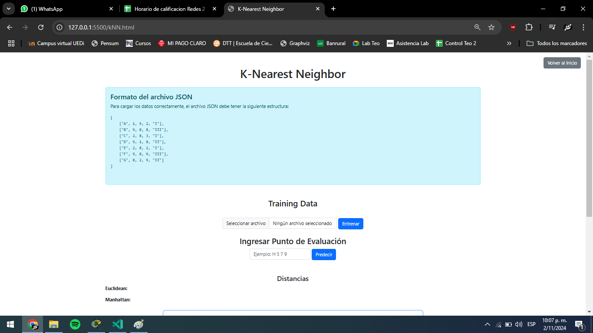

# Manual de usuario
**Luis Manuel Chay Marroquín // 202000343**

## Index

En esta pagina podemos acceder a cualquiera de los 7 modelos existentes:
- Regresion Lineal
- Regresion polinomial
- Arbol de decision
- Naive Bayes
- Redes Neuronales
- K-means
- K-Nearest Neighbors

## Regresion Lineal

En esta pagina podemos ingresar un csv para entrenar el modelo de regresion lineal, tambien se nos muestra un ejemplo de como debe de ser el csv. Y sus parametros a modificar (Porcentaje de entrenamiento, test de porcentaje, numero de iteraciones), tambien los botones de entrenamiento, predicciones y crear grafica

## Regresion Polinomial

En esta pagina podemos ingresar un csv para entrenar el modelo de regresion polinomial, tambien se nos muestra un ejemplo de como debe de ser el csv. Y sus parametros a modificar (porcentaje de entrenamiento), tambien los botones de entrenamiento, predicciones y crear grafica

## Arbol de decision

En esta pagina podemos ingresar un csv para entrenar el modelo de arbol de decision, tambien se nos muestra un ejemplo de como debe de ser el JSON. Y sus parametros a modificar (Datos a predecir), tambien los botones de entrenamiento, predicciones y crear grafica

## Naive Bayes

En esta pagina podemos ingresar un csv para entrenar el modelo de Naive Bayes, tambien se nos muestra un ejemplo de como debe de ser el JSON. Y sus parametros a modificar (porcentaje de entrenamiento), tambien los botones de entrenamiento, predicciones y crear grafica

## Redes Neuronales

En esta pagina podemos ingresar un csv para entrenar el modelo de Redes Neuronales, tambien se nos muestra un ejemplo de como debe de ser el csv. Y sus parametros a modificar (porcentaje de entrenamiento, numero de iteraciones), tambien los botones de entrenamiento, predicciones y crear grafica

## K-means

En esta pagina podemos ingresar un csv para entrenar el modelo de K-means, tambien se nos muestra un ejemplo de como debe de ser el csv. Y sus parametros a modificar (porcentaje de entrenamiento), tambien los botones de entrenamiento, predicciones y crear grafica

## K-Nearest Neighbor

En esta pagina podemos ingresar un csv para entrenar el modelo de K-Nearest Neighbors, tambien se nos muestra un ejemplo de como debe de ser el csv. Y sus parametros a modificar (porcentaje de entrenamiento), tambien los botones de entrenamiento, predicciones y crear grafica

